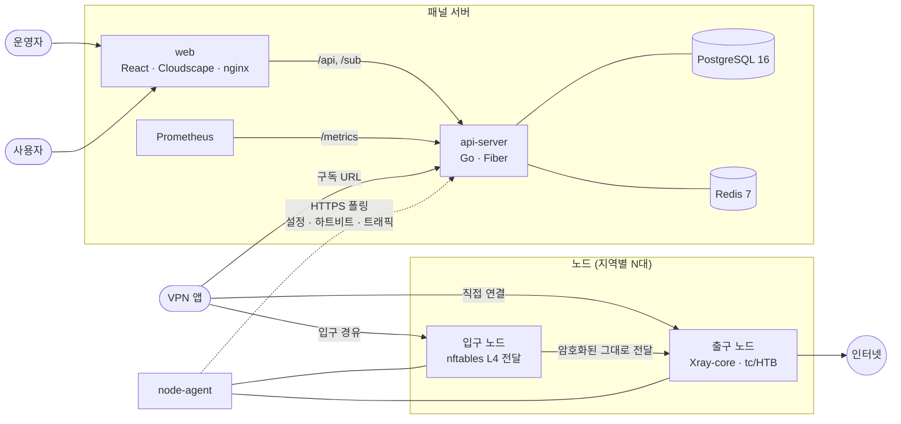
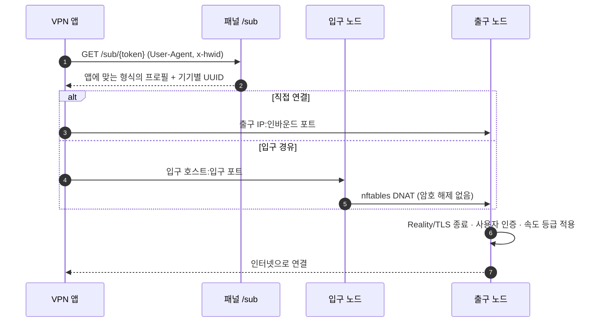

<div align="center">

[English](README.md) · **한국어**

# Proxima VPN Panel

**여러 지역의 VPN 노드와 사용자를 한곳에서 운영하는 셀프 호스팅 컨트롤 플레인**

입구·출구 노드 체인 · Xray-core 6종 프로토콜 · User-Agent 자동 감지 구독 · 요금제와 결제 · 실시간 모니터링


[빠른 시작](#-빠른-시작) · [아키텍처](#-아키텍처) · [기능](#-주요-기능) · [배포](#-운영-환경-배포) · [개발](#-개발) · [문서](#-문서)

</div>

> [!IMPORTANT]
> 이 저장소는 VPN에 접속하는 클라이언트 앱이 아니라, VPN 서비스를 **운영하는 사람**을 위한 패널입니다. 본인이 소유하거나 관리 권한이 있는 서버에서, 거주 지역의 법률과 서비스 약관을 지켜 사용하세요.

## ✨ 한눈에 보기

| | |
|---|---|
| 🛰️ **멀티 노드 운영** | 노드마다 에이전트를 설치하면 패널이 설정 배포, 10초 간격 상태 수집, 자동 업데이트를 맡습니다. |
| 🔀 **입구·출구 체인** | 입구 노드가 nftables로 연결을 커널에서 그대로 넘기고, 출구 노드가 Xray-core로 터널을 종료합니다. |
| 🔐 **6종 프로토콜** | VLESS Reality, VMess WS, Trojan TLS, Shadowsocks 2022, Hysteria2, WireGuard를 지원합니다. |
| 📲 **구독 URL 하나로 끝** | 앱의 User-Agent를 보고 Clash Meta, sing-box, Base64 등 맞는 형식을 자동으로 내려줍니다. |
| 📊 **요금제와 제한** | 데이터 한도, 기간, 속도 등급(tc/HTB), 동시 접속 수(HWID 슬롯)를 요금제 단위로 관리합니다. |
| 💳 **결제** | Stripe 호스팅 결제, 프로모션 코드, 미결제 주문 자동 만료를 지원합니다. |
| 🚨 **관측성** | 상태 기반 노드 경고, Prometheus `/metrics`, 활동 로그, Telegram 알림과 관리 봇을 제공합니다. |
| 🌐 **웹 UI** | Cloudscape 디자인 시스템, 한국어·영어·중국어, 다크 모드를 지원합니다. |

## 🏗 아키텍처



### 구성 요소

| 구성 요소 | 역할 | 기술 |
|---|---|---|
| `api-server` | REST API, 구독 생성, 스케줄러, 결제 웹훅, 메트릭 | Go 1.25, Fiber v2, pgx v5, go-redis v9, Swagger |
| `web` | 관리자 콘솔(`/admin`)과 사용자 포털(`/portal`) | React 18, TypeScript, Vite, Cloudscape, i18next, Recharts |
| `node-agent` | 노드 등록, Xray 설정 반영, nftables 전달, tc 속도 제한, 상태 보고 | Go 1.25, systemd, nftables, iproute2 |
| `pkg` | API 서버와 에이전트가 함께 쓰는 모델과 규칙 | 속도 등급, Xray 버전, 노드 프로비저닝, 암호화 |
| PostgreSQL | 사용자, 요금제, 노드, 체인, 주문, 트래픽 로그 | 16-alpine |
| Redis | 온라인 기기 추적, 동시 접속 슬롯, 레이트 리밋 | 7-alpine |

### 노드와 패널의 통신

1. 운영자가 패널에서 **등록 토큰**을 발급하고 노드에서 `install.sh`를 실행합니다.
2. 에이전트는 토큰으로 노드를 등록하고 노드 전용 키를 받습니다. 이후 모든 요청은 `X-Node-Key` 헤더로 인증합니다.
3. 에이전트는 **10초마다** 하트비트를 보냅니다. CPU·메모리·디스크, Xray 실행 여부와 설정 해시, 속도 제한 적용 결과가 담깁니다.
4. 설정이 바뀌면 다이제스트 비교로 감지해 Xray 설정과 nftables·tc 규칙을 다시 적용합니다.
5. 사용자별 트래픽과 온라인 IP는 Xray Stats API로 수집합니다. 이 때문에 Xray-core **v25.1.1 이상**이 필요합니다.

### 접속 경로



- **입구 노드**는 터널을 열지 않고 목적지만 바꿔 넘깁니다. 그래서 같은 규칙 하나로 VLESS Reality, Hysteria2, WireGuard를 모두 전달합니다. 인증은 언제나 출구 노드의 키로 이뤄집니다.
- 사용자 공간 프록시 대신 커널 nftables를 쓰는 이유는 UDP 기반(Hysteria2·WireGuard) 트래픽의 복사 비용과 지터를 없애기 위해서입니다.
- 입구 노드의 접속 주소는 **Cloudflare DNS**로 자동 관리할 수 있습니다(`CLOUDFLARE_*`, `ENTRY_DNS_BASE_DOMAIN`).

## 🧩 주요 기능

### 노드와 경로

- **노드 역할**: 출구 전용, 입구 전용, 입구·출구 겸용 중에서 고릅니다.
- **노드당 프로토콜 1개**: 한 노드는 인바운드 프로토콜을 하나만 운영합니다. Xray 설정이 노드당 하나이고, 프로토콜을 섞으면 속도 제한 사용자가 제한 없는 인바운드로 우회할 수 있기 때문입니다. API와 DB 고유 인덱스가 함께 이 규칙을 강제합니다.
- **접속 경로(체인)**: 입구 노드의 포트를 출구 노드의 포트에 연결합니다. TCP, UDP, TCP+UDP 전달을 지원하고, 여러 출구를 한 번에 추가할 수 있습니다.
- **Reality SNI 검증**: 출구 노드 대상 서버의 인증서를 확인합니다. CN 없음, SNI 불일치, 리스너 불일치가 있으면 충돌로 표시해 잘못된 프로필이 배포되지 않게 막습니다.
- **상태 기반 경고**: `offline`, `cpu`(80%↑), `memory`(85%↑), `disk`(90%↑), `xray_down`, `shaping_failed`를 추적합니다. 일시적인 튐에 반응하지 않도록 발생·해제 기준값과 유지 시간을 따로 둡니다. 대시보드 KPI에는 하루 전 스냅샷과의 차이가 함께 표시됩니다.

### 구독과 클라이언트

계정마다 구독 URL은 `GET /sub/{sub_token}` 하나입니다. 서버가 User-Agent를 보고 형식을 정하고, 경로(`/sub/{token}/{client}`)나 `?format=`으로 직접 지정할 수도 있습니다.

| 감지되는 앱 | 응답 형식 |
|---|---|
| Clash Verge Rev, mihomo, FlClash, ClashX Meta, Clash Nyanpasu | Clash Meta (VLESS 포함) |
| sing-box (SFA·SFI·SFM·SFT), Hiddify, Karing | sing-box JSON |
| Clash, Stash | Clash (레거시) |
| Surfboard / Quantumult X | 각 앱 전용 형식 |
| v2rayN·NG, Happ, Streisand, Shadowrocket 등 미등록 앱 | Base64 공유 링크 |
| 브라우저 | 사람이 읽는 안내 페이지 |

| 프로토콜 | Base64 | Clash Meta | sing-box | Surfboard | Quantumult |
|---|:---:|:---:|:---:|:---:|:---:|
| VLESS Reality | ✅ | ✅ | ✅ | — | — |
| VMess / Trojan / Shadowsocks | ✅ | ✅ | ✅ | ✅ | ✅ |
| Hysteria2 | — | ✅ | ✅ | — | — |
| WireGuard | — | ✅ | ✅ | — | — |

- 응답에는 `Subscription-Userinfo`, `Profile-Update-Interval`, `Profile-Title` 헤더가 붙어 앱이 남은 데이터와 만료일을 보여줍니다.
- WireGuard는 `.conf` 파일로도 내려받을 수 있습니다.
- 사용자가 기기를 직접 등록할 필요는 없습니다. 앱이 `x-hwid` 헤더를 보내면 설치마다 고정 UUID 슬롯을 발급하고, 동시 접속은 실제 연결을 기준으로 셉니다.

### 요금제, 제한, 결제

| 항목 | 동작 |
|---|---|
| 데이터 한도 | 노드별 트래픽 배율을 반영해 사용량을 차감하고, 월 단위로 초기화합니다. |
| 속도 등급 | `N Mbps` 등급마다 `20000+N` 포트에 전용 VLESS Reality 인바운드를 만들고, 노드에서 tc HTB로 제한합니다(최대 2000 Mbps). 속도 제한 요금제에는 이 인바운드만 제공합니다. |
| 동시 접속 | Redis 온라인 추적과 HWID 슬롯으로 제한하고, 오래된 슬롯은 스케줄러가 회수합니다. |
| 결제 | 주문 생성 → Stripe 호스팅 결제 → `/webhooks/payments/:provider` 서명 검증 → 요금제 적용 순서로 진행됩니다. |
| 프로모션 | 기간, 대상 요금제, 최소 금액, 첫 구매, 사용 횟수 조건을 지원합니다. |

### 운영과 보안

- 관리자 JWT 인증과 **TOTP 2단계 인증**을 지원합니다.
- 전역, 로그인, 구독 엔드포인트마다 **레이트 리밋**이 걸려 있습니다.
- 활동 로그를 남깁니다. 보존 기간은 트래픽 로그 90일, 노드 메트릭 14일, 활동 로그 90일입니다.
- **Telegram**으로 경고를 알림받고, 봇 명령(`/users`, `/user`, `/adduser`, `/deluser`, `/enable`, `/disable`, `/setplan`, `/traffic`, `/stats`)으로 관리할 수 있습니다.
- 백그라운드 작업: 노드 모니터, 요금제 만료, 월간 트래픽 초기화, 주문 만료, 데이터 보존, 입구 DNS 동기화, UUID 슬롯 정리.

## 🚀 빠른 시작

로컬에서 화면과 기능을 확인하는 **체험·개발용** 실행 방법입니다. Docker 24 이상과 Docker Compose v2가 필요하고, 메모리는 4GB 이상을 권장합니다.

```bash
git clone https://github.com/kimrasng/proxima-vpn.git
cd proxima-vpn
cp .env.example .env          # 아래 값을 먼저 바꾸세요
docker compose up -d --build
docker compose ps
```

```dotenv
POSTGRES_PASSWORD=replace-with-a-strong-database-password
REDIS_PASSWORD=replace-with-a-strong-redis-password
PANEL_URL=http://localhost:8080
ADMIN_EMAIL=admin@example.com
ADMIN_PASSWORD=replace-with-a-strong-admin-password
```

| 주소 | 용도 |
|---|---|
| <http://localhost:8080/admin/login> | 관리자 콘솔 |
| <http://localhost:8080/login> | 사용자 포털 |
| <http://localhost:2053/health> | API 상태 확인 |
| <http://localhost:2053/swagger/index.html> | API 문서 (`SWAGGER_ENABLED=true`일 때) |
| <http://localhost:9090> | Prometheus |

> [!TIP]
> `ADMIN_PASSWORD`를 비워 두면 처음 실행할 때 비밀번호가 만들어지고 `docker compose logs api`에 한 번 출력됩니다. `JWT_SECRET`을 비워 두면 자동 생성되어 볼륨에 보관됩니다.

<details>
<summary><b>처음 설정하는 순서</b></summary>

1. `/admin/login`에서 관리자로 로그인합니다.
2. **노드 → 노드 생성**에서 운영체제와 역할을 고르고 설치 명령을 복사합니다.
3. Linux 서버에서 그 명령을 실행합니다. 자세한 내용은 [노드 추가 안내](docs/node-setup.md)를 보세요.
4. 출구 노드에 인바운드(프로토콜과 포트)를 추가합니다.
5. 입구 노드를 쓴다면 **접속 경로**에서 입구 포트를 출구로 연결합니다.
6. 요금제를 만들고 경로를 배정합니다.
7. 사용자는 포털에서 구독 URL이나 QR을 VPN 앱에 추가합니다.

먼저 노드 하나와 인바운드 하나로 연결을 확인한 뒤, 지역과 프로토콜을 늘리는 방식을 권장합니다.

</details>

<details>
<summary><b>웹 핫 리로드, 중지, 초기화</b></summary>

```bash
# 개발용 웹 컨테이너(핫 리로드)로 전환
docker compose -f docker-compose.yml -f docker-compose.dev.yml up -d --build --no-deps web
# 기본 nginx 웹 컨테이너로 복귀
docker compose up -d --build --no-deps --force-recreate web

docker compose down        # 중지 (데이터 유지)
docker compose logs -f api web
docker compose down -v     # ⚠️ 볼륨까지 삭제 — 사용자와 설정이 모두 지워집니다
```

</details>

## 🌍 운영 환경 배포

```bash
docker compose -f docker-compose.yml -f docker-compose.prod.yml up -d --build
```

태그(`v*`)를 푸시하면 릴리스 워크플로가 `ghcr.io/kimrasng/proxima-vpn/api`, `ghcr.io/kimrasng/proxima-vpn/web` 이미지와 `node-agent` 바이너리(linux amd64/arm64)를 만듭니다. 전체 절차는 [운영 환경 설치 안내](docs/installation.md)를 참고하세요.

**권장 사양**: Linux, 2GB RAM 이상(권장 4GB), 디스크 10GB 이상, HTTPS 리버스 프록시와 도메인.

**배포 전 체크리스트**

- [ ] `.env`의 기본 비밀번호를 모두 강한 값으로 바꿨다
- [ ] `JWT_SECRET`을 `openssl rand -hex 32` 같은 긴 임의 값으로 정했다
- [ ] `PANEL_URL`을 외부에서 접근 가능한 HTTPS 주소로 정했다
- [ ] `SWAGGER_ENABLED=false`로 설정했다
- [ ] Prometheus `9090`과 `/metrics`를 외부에 공개하지 않았다
- [ ] 리버스 프록시 뒤라면 `TRUSTED_PROXIES`와 `PROXY_HEADER`를 설정했다
- [ ] 패널과 노드에서 필요한 포트만 방화벽에 열었다
- [ ] `scripts/backup-db.sh`로 정기 백업을 구성했다 (기본 7일 보관)

| 포트 | 대상 | 비고 |
|---:|---|---|
| `8080` | 웹 패널 | 보통 HTTPS 리버스 프록시 뒤에 둡니다. |
| `2053` | API 서버 | 웹이 `/api`, `/sub`를 프록시하므로 직접 공개 여부는 신중히 정하세요. |
| `9090` | Prometheus | 내부망에서만 접근하게 하세요. |
| `443` 등 | 노드 서비스 포트 | 인바운드 설정에 맞춰 엽니다. |
| `20001–22000` | 노드 속도 등급 포트 | 속도 제한 요금제를 쓸 때만 필요합니다. |

<details>
<summary><b>환경 변수</b></summary>

| 변수 | 필수 | 설명 |
|---|:---:|---|
| `POSTGRES_USER` / `POSTGRES_PASSWORD` / `POSTGRES_DB` / `DATABASE_URL` | ✅ | PostgreSQL 연결 |
| `REDIS_PASSWORD` / `REDIS_URL` | ✅ | Redis 연결 |
| `PANEL_URL` | ✅ | 노드 에이전트와 구독 링크가 쓰는 외부 주소 |
| `ADMIN_EMAIL` / `ADMIN_PASSWORD` | ✅ | DB를 처음 만들 때 생성되는 관리자 계정 |
| `JWT_SECRET` | 권장 | 비우면 자동 생성 |
| `TRUSTED_PROXIES` / `PROXY_HEADER` | | 리버스 프록시 뒤에서 실제 클라이언트 IP를 읽을 때 |
| `TELEGRAM_ENABLED` / `TELEGRAM_BOT_TOKEN` / `TELEGRAM_CHAT_ID` | | Telegram 알림과 봇 |
| `CLOUDFLARE_API_TOKEN` / `CLOUDFLARE_ZONE_ID` / `ENTRY_DNS_BASE_DOMAIN` | | 입구 노드 DNS 자동 관리 |
| `STRIPE_SECRET_KEY` / `STRIPE_WEBHOOK_SECRET` | | Stripe 결제 |
| `PAYMENTS_CURRENCY` / `PAYMENTS_PENDING_TTL` | | 결제 통화와 미결제 주문 만료 시간 |
| `S3_ENDPOINT` / `S3_BUCKET` / `S3_ACCESS_KEY` / `S3_SECRET_KEY` / `S3_REGION` | | S3 호환 저장소 |
| `SWAGGER_ENABLED` | | API 문서 노출 (운영에서는 `false`) |

`.env`에는 비밀 값이 들어 있으니 커밋하거나 공유하지 마세요.

</details>

## 🛰 노드 추가

관리자 콘솔의 **노드 생성** 마법사가 운영체제(Debian/Ubuntu, RHEL 계열, Alpine), 역할, 서비스 포트, 방화벽 프리셋을 묻고 설치 명령을 만들어 줍니다. 단, 현재 `install.sh`는 apt와 dnf/yum만 지원하고 Alpine(apk)은 아직 지원하지 않습니다. 설치 스크립트가 하는 일은 다음과 같습니다.

- 의존 패키지(`curl`, `jq`, `nftables`, `iproute2` 등)와 Xray-core 설치
- `node-agent` systemd 서비스 등록과 패널 등록
- `ufw` 또는 `firewalld`가 켜져 있으면 필요한 포트를 엽니다. 둘 다 없으면 직접 열라는 안내만 출력합니다.

```bash
systemctl status node-agent
journalctl -u node-agent --no-pager -n 50
```

자세한 내용은 [노드 추가 안내](docs/node-setup.md)를 보세요.

## 🛠 개발

```text
proxima-vpn/
├── api-server/         Go API 서버
│   ├── cmd/            진입점, migrate 도구
│   └── internal/       handlers · services · scheduler · reality · payments · telegram · metrics
├── node-agent/         노드 에이전트
│   └── internal/       client · xray · relay(nftables) · shaper(tc) · stats · updater · cert
├── pkg/                공용 패키지 (models · speedtier · xrayver · nodeprov · useragent · crypto)
├── web/                React + TypeScript (admin · portal · i18n ko/en/zh · Playwright)
├── scripts/            install · update · uninstall · backup · e2e
├── tests/              relay / direct / device-bandwidth / installer e2e
└── docs/               설치 · 노드 · 문제 해결 · 설계 문서
```

Go 워크스페이스(`go.work`)로 `api-server`, `node-agent`, `pkg` 세 모듈을 묶어 관리합니다.

```bash
make help          # 사용할 수 있는 명령 보기
make build         # api-server, node-agent 빌드 (CGO_ENABLED=0)
make test          # 세 모듈 Go 테스트
make lint          # go vet + golangci-lint + eslint
make dev-api       # API 서버 실행
make dev-web       # Vite 개발 서버 실행

cd web && npm run check:locales   # ko/en/zh 번역 키 일치 검사
cd web && npm run test:e2e        # Playwright
```

DB를 쓰는 통합 테스트는 `TEST_DATABASE_URL`, `TEST_REDIS_ADDR`가 있을 때만 실행되고, 없으면 건너뜁니다.

### CI

| 워크플로 | 내용 |
|---|---|
| `ci.yml` | PostgreSQL·Redis 서비스 위에서 마이그레이션 후 `go test -race`, golangci-lint, 웹 eslint·번역 키 검사·빌드 |
| `e2e.yml` | 실제 Xray-core로 입구→출구 릴레이 E2E와 전체 프로토콜 E2E, Playwright(Chromium) |
| `release.yml` | `v*` 태그에서 node-agent 바이너리와 GHCR 이미지 빌드 |

## 🩺 문제 해결

<details>
<summary><b>화면이 열리지 않아요</b></summary>

```bash
docker compose ps
docker compose logs api web
ss -tlnp | grep -E ':(8080|2053)'
```

</details>

<details>
<summary><b>관리자 로그인이 안 돼요</b></summary>

관리자 계정은 DB를 처음 만들 때 한 번만 생성됩니다. 나중에 `.env`의 `ADMIN_PASSWORD`를 바꿔도 기존 비밀번호는 바뀌지 않습니다. 비밀번호를 비워 두고 처음 실행했다면 `docker compose logs api`에서 확인하세요.

</details>

<details>
<summary><b>노드가 오프라인으로 보여요</b></summary>

노드에서 `systemctl status node-agent`와 `journalctl -u node-agent`를 확인하세요. 노드가 `PANEL_URL`에 접속할 수 있는지, 등록 토큰이 만료되지 않았는지, 방화벽이 막고 있지 않은지도 확인하세요. Xray 버전이 v25.1.1보다 낮으면 노드 목록에 경고가 뜹니다.

</details>

더 많은 사례는 [문제 해결 안내](docs/troubleshooting.md)에 있습니다.

## 📚 문서

| 문서 | 내용 |
|---|---|
| [운영 환경 설치](docs/installation.md) | 요구 사항, Docker 배포, TLS, 입구 DNS 설정 |
| [VPN 노드 추가](docs/node-setup.md) | 등록 토큰, 설치 스크립트 옵션, 포트 |
| [문제 해결](docs/troubleshooting.md) | 로그 확인, 포트 충돌, 초기 계정 |
| [사용자 포털 UX](docs/user-portal-ux.md) | 포털 화면 구성과 검증 방법 |
| [설계 문서](docs/design/) | 입구·출구 관리, HWID·UUID 동시 접속, 기기별 대역폭 |

## 👥 메인테이너

| | 이름 | 역할 | 링크 |
|:---:|---|---|---|
|  | **Dohyun Kim** | 메인테이너 | [@kimrasng](https://github.com/kimrasng) · [LinkedIn](https://www.linkedin.com/in/dohyun1223/) · [dohyun.kim@solix.kr](mailto:dohyun.kim@solix.kr) |
|  | **Yuchan Han** | 공동 메인테이너 | [@h053698](https://github.com/h053698) · [LinkedIn](https://www.linkedin.com/in/yuchan-han/) · [yuchan.han@solixsolutions.us](mailto:yuchan.han@solixsolutions.us) |

## 📄 라이선스

MIT

---

<div align="center">

<a href="https://solixsolutions.us/en/proxima">
  <picture>
    <source media="(prefers-color-scheme: dark)" srcset="docs/assets/solix-wordmark-dark.svg">
    
  </picture>
</a>

**Solix Corporation** 프로젝트입니다. Proxima에 대한 자세한 소개는 **[solixsolutions.us/en/proxima](https://solixsolutions.us/en/proxima)** 에서 볼 수 있습니다.

</div>
