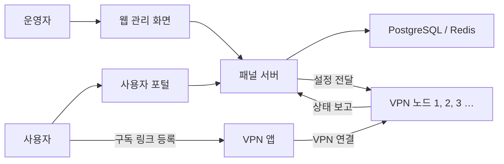

# Proxima VPN Panel

여러 VPN 서버와 사용자를 한곳에서 관리하는 **셀프 호스팅 VPN 운영 패널**입니다.

Proxima VPN Panel은 VPN에 바로 접속하는 일반 사용자용 앱이 아닙니다. 서버 운영자가 웹 화면에서 VPN 서버(노드), 사용자, 요금제, 사용량을 관리하고, 사용자는 발급받은 구독 링크를 자신의 VPN 앱에 등록해 접속하는 구조입니다.

> 이 프로젝트는 본인이 소유하거나 관리 권한이 있는 서버에서, 거주 지역의 법률과 서비스 약관을 준수해 사용하세요.

## 이런 경우에 적합합니다

- 여러 지역의 VPN 서버를 하나의 화면에서 관리하고 싶을 때
- 사용자별 데이터 한도, 만료일, 속도, 동시 접속 수를 관리하고 싶을 때
- 사용자가 VPN 앱에 쉽게 등록할 수 있도록 구독 링크를 제공하고 싶을 때
- 서버 상태와 트래픽을 실시간으로 확인하고 싶을 때

단순히 개인용 VPN 하나에 접속하려는 사용자라면 이 프로젝트 전체를 설치할 필요가 없습니다. 이 프로젝트는 VPN 서비스를 **운영하는 사람**을 위한 도구에 가깝습니다.

## 무엇을 할 수 있나요?

### 운영자

- 여러 VPN 노드를 등록하고 온라인 상태와 트래픽 확인
- VLESS Reality, VMess, Trojan, Shadowsocks, Hysteria2, WireGuard 인바운드 구성
- 사용자와 요금제 생성 및 데이터 한도·속도·만료일·동시 접속 수 관리
- 사용자 접속 현황, 활동 기록, 경고 확인
- 공지사항, 2단계 인증, Telegram 알림/봇 설정
- Prometheus를 이용한 상태 모니터링

### 사용자

- 자신의 요금제, 남은 데이터, 만료일 확인
- 사용할 기기 등록 및 관리
- 구독 링크를 VPN 클라이언트에 추가
- 공지사항과 사용량 확인

웹 화면은 한국어, 영어, 중국어를 지원하며 다크 모드도 제공합니다.

## 처음 나오는 용어

| 용어 | 쉬운 설명 |
|---|---|
| 패널 서버 | 관리자 화면, 사용자 화면, 데이터베이스가 실행되는 중앙 서버입니다. |
| 노드(Node) | 사용자의 VPN 연결을 실제로 받아 주는 서버입니다. 국가나 지역별로 여러 대를 둘 수 있습니다. |
| 노드 에이전트 | 각 노드에 설치되어 패널의 설정을 전달받고 상태를 보고하는 프로그램입니다. |
| 인바운드(Inbound) | 노드가 어떤 VPN 방식과 포트로 연결을 받을지 정한 설정입니다. |
| 구독 링크 | 서버 접속 정보를 묶어 제공하는 주소입니다. 사용자가 VPN 앱에 이 주소를 추가합니다. |

## 동작 방식



패널 서버와 VPN 노드는 같은 서버에 있을 필요가 없습니다. 보통 패널은 한 대만 운영하고, 실제 VPN 트래픽을 처리하는 노드는 필요한 지역마다 추가합니다.

## 5분 만에 로컬에서 실행하기

아래 과정은 내 컴퓨터에서 화면과 기능을 확인하는 **체험/개발용 실행 방법**입니다. 실제 서비스 운영은 [운영 환경 설치 안내](docs/installation.md)를 참고하세요.

### 1. 준비물

- Git
- Docker 24 이상
- Docker Compose v2 (`docker compose` 명령을 사용)
- 권장 메모리 4GB 이상

Windows나 macOS에서는 Docker Desktop을 사용할 수 있습니다. 실제 VPN 노드 설치는 Linux 서버가 필요합니다.

### 2. 저장소 내려받기

```bash
git clone https://github.com/kimrasng/proxima-vpn.git
cd proxima-vpn
```

이미 저장소를 내려받았다면 이 단계는 건너뛰세요.

### 3. 환경 설정 파일 만들기

```bash
cp .env.example .env
```

`.env` 파일을 열고 최소한 아래 항목을 확인하거나 변경하세요.

```dotenv
POSTGRES_PASSWORD=replace-with-a-strong-database-password
REDIS_PASSWORD=replace-with-a-strong-redis-password
PANEL_URL=http://localhost:8080
ADMIN_EMAIL=admin@example.com
ADMIN_PASSWORD=replace-with-a-strong-admin-password
```

`JWT_SECRET`은 비워 두면 처음 실행할 때 자동 생성되어 Docker 볼륨에 보관됩니다. 실제 운영 환경에서는 다음 명령으로 직접 만든 값을 사용하는 편이 좋습니다.

```bash
openssl rand -hex 32
```

`.env`에는 비밀번호와 비밀키가 들어 있으므로 Git에 커밋하거나 다른 사람에게 공유하지 마세요.

### 4. 실행하기

```bash
docker compose up -d --build
```

처음 실행할 때는 이미지를 내려받고 빌드하므로 몇 분 정도 걸릴 수 있습니다. 모든 서비스가 실행되었는지 확인합니다.

```bash
docker compose ps
```

브라우저에서 아래 주소를 여세요.

- 관리자 로그인: <http://localhost:8080/admin/login>
- 사용자 로그인: <http://localhost:8080/login>
- API 상태 확인: <http://localhost:2053/health>
- Prometheus: <http://localhost:9090>

관리자 로그인에는 `.env`의 `ADMIN_EMAIL`과 `ADMIN_PASSWORD`를 사용합니다. `ADMIN_PASSWORD`를 비워 두었다면 자동 생성된 비밀번호가 API 로그에 한 번 출력됩니다.

```bash
docker compose logs api
```

### 5. 중지하거나 다시 시작하기

```bash
# 중지
docker compose down

# 다시 시작
docker compose up -d

# 실행 로그 보기
docker compose logs -f api web
```

`docker compose down`은 저장된 데이터를 유지합니다. 반면 `docker compose down -v`는 사용자와 설정이 들어 있는 Docker 볼륨까지 삭제하므로 초기화가 꼭 필요할 때만 사용하세요.

## 설치 후 실제 사용 순서

처음에는 아래 순서대로 설정하면 됩니다.

1. `/admin/login`에서 관리자 계정으로 로그인합니다.
2. **노드** 메뉴에서 등록 토큰을 발급합니다.
3. VPN 트래픽을 처리할 Linux 서버에 노드 에이전트를 설치합니다. 자세한 과정은 [노드 추가 안내](docs/node-setup.md)를 참고하세요.
4. 등록된 노드에 인바운드를 추가해 사용할 프로토콜과 포트를 정합니다.
5. 데이터 한도, 기간, 속도 등이 포함된 요금제를 만듭니다.
6. 사용자를 만들거나 사용자의 가입/요금제 요청을 승인합니다.
7. 사용자는 포털에서 기기를 등록하고 구독 링크를 VPN 앱에 추가합니다.

처음부터 모든 프로토콜을 알 필요는 없습니다. 먼저 하나의 노드와 하나의 인바운드로 연결을 확인한 뒤, 필요한 프로토콜과 지역을 추가하는 방식을 권장합니다.

## 지원 프로토콜과 구독 형식

지원하는 VPN 프로토콜은 다음과 같습니다.

- VLESS Reality
- VMess
- Trojan
- Shadowsocks
- Hysteria2
- WireGuard

구독 정보는 V2Ray, Clash, Sing-box, Surfboard, Quantumult 형식으로 제공할 수 있습니다. 다만 클라이언트 형식 자체의 제약 때문에 다음 차이가 있습니다.

| 프로토콜 | V2Ray | Clash Meta / Mihomo | Sing-box | Surfboard | Quantumult |
|---|:---:|:---:|:---:|:---:|:---:|
| VLESS Reality | 지원 | 지원 | 지원 | 미지원 | 미지원 |
| VMess / Trojan / Shadowsocks | 지원 | 지원 | 지원 | 지원 | 지원 |
| Hysteria2 | 미지원 | 지원 | 지원 | 미지원 | 미지원 |
| WireGuard | 미지원 | 지원 | 지원 | 미지원 | 미지원 |

WireGuard는 전용 `.conf` 파일로도 내려받을 수 있습니다. 속도 제한이 설정된 요금제는 제한을 우회할 수 없도록 VLESS Reality만 제공합니다. 실제 사용 가능 여부는 사용 중인 VPN 앱이 해당 프로토콜과 구독 형식을 지원하는지에 따라 달라집니다.

## 실제 서버에 배포하기

운영 환경의 권장 조건은 다음과 같습니다.

- Ubuntu 20.04+, Debian 11+, CentOS 8+ 기반 Linux 서버
- 최소 2GB RAM, 권장 4GB RAM
- 10GB 이상의 디스크 공간
- Docker 24 이상과 Docker Compose v2
- HTTPS 적용을 위한 도메인과 리버스 프록시 권장

전체 설치 과정은 [운영 환경 설치 안내](docs/installation.md)에 정리되어 있습니다.

```bash
docker compose -f docker-compose.yml -f docker-compose.prod.yml up -d --build
```

운영을 시작하기 전에는 반드시 다음을 확인하세요.

- `.env`의 기본 비밀번호를 모두 강한 값으로 변경
- `JWT_SECRET`을 임의의 긴 값으로 설정
- `PANEL_URL`을 외부에서 접근 가능한 HTTPS 주소로 설정
- `SWAGGER_ENABLED=false`로 설정
- Prometheus의 9090 포트를 외부에 공개하지 않기
- 패널과 노드에서 실제로 필요한 포트만 방화벽에 허용
- 정기 백업 구성

로컬 Docker 구성에서 사용하는 주요 포트는 다음과 같습니다.

| 포트 | 역할 | 운영 시 참고 |
|---:|---|---|
| 8080 | 웹 패널 | 보통 리버스 프록시를 통해 HTTPS로 공개합니다. |
| 2053 | API 서버 | 웹 패널이 프록시할 수 있으므로 외부 공개 여부를 신중히 결정하세요. |
| 9090 | Prometheus | 내부에서만 접근하도록 제한하는 것을 권장합니다. |
| 443 등 | VPN 노드의 접속 포트 | 선택한 인바운드 설정에 따라 노드 서버에서 엽니다. |

## 자주 생기는 문제

### 화면이 열리지 않아요

컨테이너 상태와 로그부터 확인하세요.

```bash
docker compose ps
docker compose logs api
docker compose logs web
```

8080 또는 2053 포트를 다른 프로그램이 이미 사용 중인지도 확인해야 합니다.

### 관리자 로그인이 안 돼요

- `.env`의 `ADMIN_EMAIL`과 `ADMIN_PASSWORD`를 다시 확인하세요.
- 관리자 계정은 데이터베이스가 처음 생성될 때 한 번 만들어집니다. 실행 후 `.env`의 비밀번호만 바꿔도 기존 관리자 비밀번호는 자동으로 바뀌지 않습니다.
- `ADMIN_PASSWORD`를 비워 두고 처음 실행했다면 `docker compose logs api`에서 자동 생성된 비밀번호를 확인하세요.

### 노드가 Offline으로 표시돼요

노드 서버에서 다음 명령으로 에이전트 상태와 로그를 확인하세요.

```bash
systemctl status node-agent
journalctl -u node-agent --no-pager -n 50
```

노드가 패널 주소에 접속할 수 있는지, 등록 토큰이 만료되지 않았는지, 방화벽이 통신을 막고 있지 않은지도 확인하세요.

더 많은 해결 방법은 [문제 해결 안내](docs/troubleshooting.md)를 참고하세요.

## 개발자를 위한 정보

프로젝트의 주요 구성은 다음과 같습니다.

```text
api-server/   Go 기반 API 서버
node-agent/   VPN 노드에 설치되는 에이전트
pkg/          API 서버와 에이전트가 공유하는 Go 패키지
web/          React + TypeScript 웹 화면
docs/         설치, 노드 등록, 문제 해결 문서
scripts/      설치, 삭제, 업데이트, 백업 스크립트
```

자주 사용하는 개발 명령은 다음과 같습니다.

```bash
make help       # 사용할 수 있는 명령 보기
make build      # API 서버와 노드 에이전트 빌드
make test       # Go 테스트 실행
make lint       # Go 및 프런트엔드 검사
make dev-api    # API 서버 개발 모드 실행
make dev-web    # 웹 개발 서버 실행
```

API 문서는 개발 환경에서 <http://localhost:2053/swagger/index.html>로 확인할 수 있습니다. 운영 환경에서는 Swagger를 비활성화하는 것을 권장합니다.

## 관련 문서

- [운영 환경 설치](docs/installation.md)
- [VPN 노드 추가](docs/node-setup.md)
- [문제 해결](docs/troubleshooting.md)

## 라이선스

MIT
