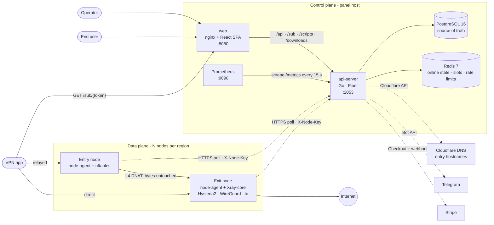
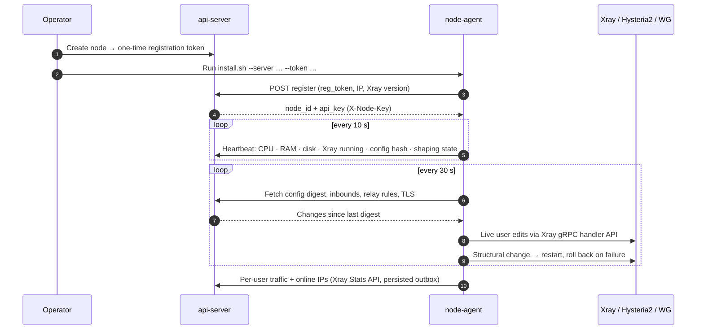
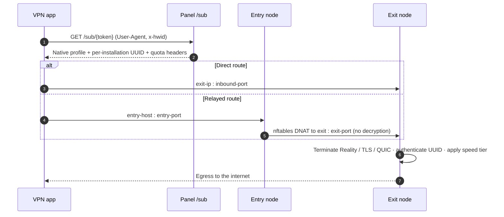
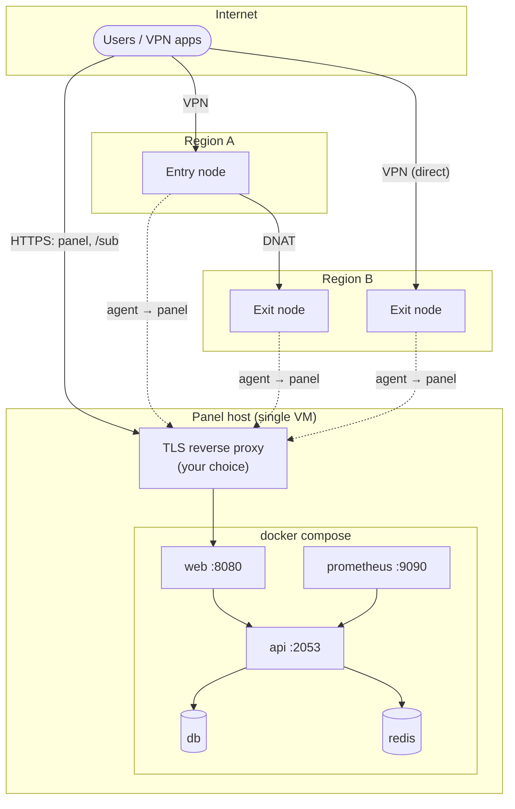
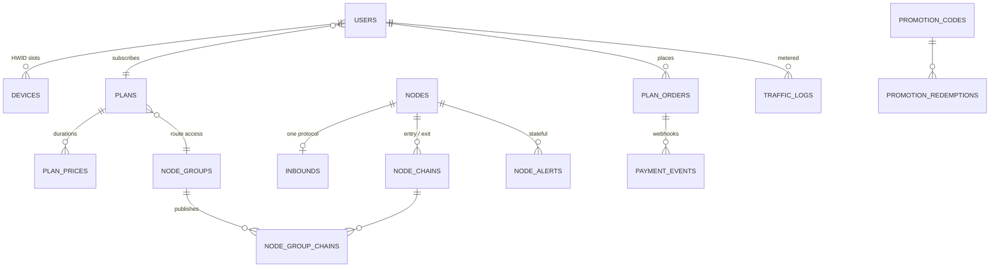

<div align="center">

**English** · [한국어](README.ko.md)

# Proxima VPN Panel

**A self-hosted control plane for running a multi-region VPN service.**

Entry → exit node chains · six VPN protocols · one subscription URL that adapts to every client · plans, quotas and payments · live fleet telemetry


[](LICENSE)

[Quick start](#-quick-start) · [Architecture](#-architecture) · [Infrastructure](#-infrastructure) · [Features](#-features) · [Deploy](#-production-deployment) · [Develop](#-development)

</div>

> [!IMPORTANT]
> This repository is not a VPN client. It is the panel an **operator** uses to run VPN infrastructure: nodes, routes, users, plans and billing. Only deploy it on servers you own or are authorized to manage, and comply with the laws and terms of service that apply to you.

## ✨ Highlights

| | |
|---|---|
| 🛰️ **Fleet management** | A Go agent on every node registers itself, applies config pushed by the panel, reports health every 10 s and self-updates. |
| 🔀 **Entry → exit chains** | Entry nodes forward packets in-kernel with nftables DNAT; exit nodes terminate the tunnel. No userspace hop, no re-encryption. |
| 🔐 **Six protocols** | VLESS Reality, VMess WS, Trojan TLS, Shadowsocks 2022, Hysteria2 and WireGuard. |
| 📲 **One URL, every client** | `/sub/{token}` sniffs the User-Agent and serves Clash Meta, sing-box, Surfboard, Quantumult, legacy Clash or Base64 share links. |
| 📊 **Plans that hold** | Data quotas, expiry, speed tiers enforced with `tc` HTB, and concurrent-device caps enforced with HWID-bound UUID slots. |
| 💳 **Billing built in** | Stripe hosted checkout, signed webhooks, promo codes, automatic expiry of unpaid orders. |
| 🚨 **Operations** | Stateful node alerts with hysteresis, Prometheus `/metrics`, activity log, Telegram alerts plus an admin bot. |
| 🌐 **Polished UI** | Admin console and user portal on AWS Cloudscape, in English, Korean and Chinese, light and dark. |

## 🏗 Architecture

Proxima splits cleanly into a **control plane** (the panel) and a **data plane** (the nodes). Client traffic never touches the panel: the panel only issues configuration and subscriptions, and collects telemetry.


```mermaid
flowchart LR
    subgraph CP["Control plane · panel host"]
        direction TB
        NGX["web<br/>nginx + React SPA<br/>:8080"]
        API["api-server<br/>Go · Fiber<br/>:2053"]
        PG[("PostgreSQL 16<br/>source of truth")]
        RD[("Redis 7<br/>online state · slots · rate limits")]
        PROM["Prometheus<br/>:9090"]
        NGX -->|"/api · /sub · /scripts · /downloads"| API
        API --> PG
        API --> RD
        PROM -->|"scrape /metrics every 15 s"| API
    end

    subgraph DP["Data plane · N nodes per region"]
        direction TB
        ENTRY["Entry node<br/>node-agent + nftables"]
        EXIT["Exit node<br/>node-agent + Xray-core<br/>Hysteria2 · WireGuard · tc"]
        ENTRY -->|"L4 DNAT, bytes untouched"| EXIT
    end

    OPS(["Operator"]) --> NGX
    USR(["End user"]) --> NGX
    APP(["VPN app"]) -->|"GET /sub/{token}"| NGX
    APP -->|"relayed"| ENTRY
    APP -->|"direct"| EXIT
    EXIT --> NET(("Internet"))

    ENTRY -. "HTTPS poll · X-Node-Key" .-> API
    EXIT -. "HTTPS poll · X-Node-Key" .-> API
    API -. "Cloudflare API" .-> CF["Cloudflare DNS<br/>entry hostnames"]
    API -. "Bot API" .-> TG["Telegram"]
    API -. "Checkout + webhooks" .-> ST["Stripe"]
```

### Components

| Component | Responsibility | Stack |
|---|---|---|
| **`api-server`** | REST API, subscription rendering, schedulers, payment webhooks, Prometheus metrics, Swagger | Go 1.25, Fiber v2, pgx v5, go-redis v9, stripe-go, telegram-bot-api |
| **`web`** | Admin console (`/admin`) and user portal (`/portal`), served by nginx with security headers and gzip | React 18, TypeScript 5.6, Vite, Cloudscape, i18next, Recharts |
| **`node-agent`** | Registration, Xray / Hysteria2 / WireGuard lifecycle, nftables relay rules, `tc` shaping, traffic collection, ACME certificates, self-update | Go 1.25, systemd, nftables, iproute2, wg-quick, lego |
| **`pkg`** | Contracts shared by panel and agent | speed tiers, Xray version gate, node provisioning, User-Agent parsing, crypto |
| **PostgreSQL** | Users, plans, prices, orders, nodes, inbounds, chains, traffic logs, alerts, audit trail | 16-alpine |
| **Redis** | Live online devices, HWID → UUID slot leases, rate-limit counters | 7-alpine, AOF `everysec`, `allkeys-lru` |
| **Prometheus** | Scrapes the API every 15 s; kept off the public internet | `prom/prometheus` |

### Control loop: panel ↔ node-agent

The agent always dials out to the panel, so nodes need no inbound management port and work behind NAT. Every call is authenticated with the per-node key minted at registration.


```mermaid
sequenceDiagram
    autonumber
    participant Op as Operator
    participant API as api-server
    participant Ag as node-agent
    participant X as Xray / Hysteria2 / WG
    Op->>API: Create node → one-time registration token
    Op->>Ag: Run install.sh --server … --token …
    Ag->>API: POST register (reg_token, IP, Xray version)
    API-->>Ag: node_id + api_key (X-Node-Key)
    loop every 10 s
        Ag->>API: Heartbeat: CPU · RAM · disk · Xray running · config hash · shaping state
    end
    loop every 30 s
        Ag->>API: Fetch config digest, inbounds, relay rules, TLS
        API-->>Ag: Changes since last digest
        Ag->>X: Live user edits via Xray gRPC handler API
        Ag->>X: Structural change → restart, roll back on failure
    end
    Ag->>API: Per-user traffic + online IPs (Xray Stats API, persisted outbox)
```

| Agent loop | Interval | What it does |
|---|---:|---|
| Heartbeat | 10 s | Resource usage, process health, applied config hash, shaping status |
| Config / inbounds / relay rules | 30 s | Diffs the config digest; edits users live over gRPC, restarts only on structural changes |
| Revocation snapshot | 500 ms | Pulls revoked UUIDs and closes live sessions within one cycle |
| Supervisor | 10 s, backoff ≤ 5 min | Restarts a crashed or OOM-killed Xray without hot-looping |
| Self-update / Xray update | 5 min / 30 s | Swaps the binary while the old process keeps serving; systemd restarts it |
| TLS renewal | 24 h | ACME HTTP-01 via lego for TLS-based inbounds |

Traffic counters are read from Xray and written to an **on-disk outbox before upload**, so a panel outage never loses billing data.

### Data path: how a client actually connects


```mermaid
sequenceDiagram
    autonumber
    participant App as VPN app
    participant Sub as Panel /sub
    participant In as Entry node
    participant Out as Exit node
    App->>Sub: GET /sub/{token} (User-Agent, x-hwid)
    Sub-->>App: Native profile + per-installation UUID + quota headers
    alt Direct route
        App->>Out: exit-ip : inbound-port
    else Relayed route
        App->>In: entry-host : entry-port
        In->>Out: nftables DNAT to exit : exit-port (no decryption)
    end
    Out->>Out: Terminate Reality / TLS / QUIC · authenticate UUID · apply speed tier
    Out-->>App: Egress to the internet
```

- **Entry nodes never terminate the tunnel.** They rewrite the destination and forward, so one rule set carries VLESS Reality, Hysteria2 and WireGuard alike, and credentials always belong to the exit node.
- **Why the kernel, not a proxy:** Hysteria2 (QUIC) and WireGuard are UDP. A userspace hop would copy every packet and add jitter that shows up directly as lost throughput.
- **Entry hostnames** can be managed automatically in Cloudflare DNS. The reconciler runs every 30 s and keeps each entry node's record in sync.

## 🧱 Infrastructure

### Topology


```mermaid
flowchart TB
    subgraph Internet
        U(["Users / VPN apps"])
    end

    subgraph PanelHost["Panel host (single VM)"]
        RP["TLS reverse proxy<br/>(your choice)"]
        subgraph Compose["docker compose"]
            WEB["web :8080"]
            API["api :2053"]
            DB[("db")]
            RDS[("redis")]
            PR["prometheus :9090"]
        end
        RP --> WEB
        WEB --> API
        API --> DB
        API --> RDS
        PR --> API
    end

    subgraph RegionA["Region A"]
        E1["Entry node"]
    end
    subgraph RegionB["Region B"]
        X1["Exit node"]
        X2["Exit node"]
    end

    U -->|"HTTPS: panel, /sub"| RP
    U -->|"VPN"| E1
    U -->|"VPN (direct)"| X2
    E1 -->|"DNAT"| X1
    E1 -. "agent → panel" .-> RP
    X1 -. "agent → panel" .-> RP
    X2 -. "agent → panel" .-> RP
```

A typical deployment is **one panel VM** and **any number of node VMs**. Entry nodes usually sit in a region with good reachability to users, and exit nodes in the regions users want to appear from. One host can also take the combined *entry + exit* role.

### Containers (panel host)

| Service | Image | Port | Volumes | Prod limits (`docker-compose.prod.yml`) |
|---|---|---:|---|---|
| `db` | `postgres:16-alpine` | internal | `pg_data`, `db_backups` | 512 MiB, tuned `postgresql.conf`, healthcheck `pg_isready` |
| `redis` | `redis:7-alpine` | internal | `redis_data` | 256 MiB, password, AOF, healthcheck `redis-cli ping` |
| `api` | built from `api-server/Dockerfile` (alpine 3.19) | `2053` | `uploads_data`, `app_data` (auto-generated JWT secret) | 512 MiB, healthcheck `/health` |
| `web` | built from `web/Dockerfile` (nginx alpine) | `8080` | — | 128 MiB, healthcheck `/` |
| `prometheus` | `prom/prometheus` | `9090` | `prometheus.yml` | 256 MiB |

All services restart `unless-stopped` and rotate JSON logs at 10 MB × 3. The API image also **serves the node installer and agent binaries** (`/scripts`, `/downloads/node-agent-linux-{amd64,arm64}`), so nodes bootstrap from your own panel and never from a third party.

### Request routing (nginx in `web`)

| Path | Target | Notes |
|---|---|---|
| `/` | SPA (`index.html` fallback) | React router handles `/admin/*` and `/portal/*` |
| `/api/` | `api:2053` | Forwards `X-Real-IP` / `X-Forwarded-For`; the API trusts them only from `TRUSTED_PROXIES` |
| `/sub/` | `api:2053` | Subscription endpoint, rate-limited |
| `/scripts/`, `/downloads/` | `api:2053` | Node installer and agent binaries |
| `/health` | `api:2053` | Liveness |
| `/metrics` | **404** in prod | Scrape it from inside the Docker network only |

### Node host

| Piece | Exit node | Entry node |
|---|:---:|:---:|
| `node-agent` (systemd, `Restart=always`) | ✅ | ✅ |
| Xray-core ≥ v25.1.1 (gRPC Stats + Handler API) | ✅ | — |
| Hysteria2 / WireGuard (`wg-quick`) processes | when configured | — |
| `tc` HTB shaping on egress | ✅ | — |
| nftables `proxima_relay` table, atomic replace | — | ✅ |
| ufw / firewalld ports opened by the installer | ✅ | ✅ |

The installer detects **apt (Debian/Ubuntu)** or **dnf/yum (RHEL family)** and runs on **amd64 and arm64**. It pulls `curl`, `jq`, `nftables`, `iproute2` and Xray-core, then registers the systemd unit. The provisioning wizard also lists Alpine, but `install.sh` has no apk path yet.

### Data model at a glance


```mermaid
erDiagram
    USERS ||--o{ DEVICES : "HWID slots"
    USERS }o--|| PLANS : subscribes
    PLANS ||--o{ PLAN_PRICES : "durations"
    PLANS }o--|| NODE_GROUPS : "route access"
    NODE_GROUPS ||--o{ NODE_GROUP_CHAINS : publishes
    NODE_CHAINS ||--o{ NODE_GROUP_CHAINS : ""
    NODES ||--o| INBOUNDS : "one protocol"
    NODES ||--o{ NODE_CHAINS : "entry / exit"
    USERS ||--o{ PLAN_ORDERS : places
    PLAN_ORDERS ||--o{ PAYMENT_EVENTS : "webhooks"
    PROMOTION_CODES ||--o{ PROMOTION_REDEMPTIONS : ""
    USERS ||--o{ TRAFFIC_LOGS : "metered"
    NODES ||--o{ NODE_ALERTS : "stateful"
```

Migrations are idempotent and run on API startup (`api-server/cmd/migrate` runs them standalone in CI).

### Background jobs (api-server)

| Job | Cadence | Purpose |
|---|---:|---|
| Node monitor | 15 s | Offline sweep and stateful alert evaluation, with Telegram fan-out |
| UUID slot reconciler | 10 s | Reconciles Redis slot leases against node-reported online UUIDs |
| Concurrency | 10 s / 10 min | Enforces concurrent-device caps and evicts stale slots |
| Managed entry DNS | 30 s | Cloudflare record reconciliation for entry nodes |
| Dashboard snapshot | 15 min | Stores KPIs so the dashboard can show day-over-day deltas |
| Plan expiry / order expiry | 5 min | Expires plans and unpaid orders |
| Traffic reset | 1 h | Monthly quota resets |
| Retention | 24 h | Traffic logs 90 d · node metrics 14 d · activity log 90 d |

## 🧩 Features

### Nodes and routes

- **Roles**: *exit-only*, *entry-only* or *entry + exit*.
- **One protocol per node**: Xray takes a single config per node, and mixing protocols would let a speed-limited user reach an uncapped inbound. The API returns `409` and a unique DB index on `inbounds(node_id)` backs it up.
- **Routes (chains)**: map an entry port to an exit port over TCP, UDP or both, and fan out to several exits in one batch. Routes are published to plans through node groups.
- **Reality SNI validation**: the panel probes the exit's target and flags `no_common_name`, `invalid_sni`, `listener_mismatch` or `not_reality` before a broken profile reaches users.
- **Stateful alerts**: `offline`, `cpu` ≥ 80 %, `memory` ≥ 85 %, `disk` ≥ 90 %, `xray_down`, `shaping_failed`. Each has separate fire and clear thresholds plus hold times, so a brief spike does not page anyone.

### Subscriptions

Each account has a **single URL**: `GET /sub/{sub_token}`. The format is chosen by an explicit path segment (`/sub/{token}/clash-meta`), then `?format=`, then User-Agent detection.

| Detected client | Served format |
|---|---|
| Clash Verge Rev, mihomo, FlClash, ClashX Meta, Clash Nyanpasu, Clashmi | Clash Meta (VLESS-capable) |
| sing-box (SFA · SFI · SFM · SFT), Hiddify, Karing | sing-box JSON |
| Clash, Stash | Legacy Clash |
| Surfboard · Quantumult X | Native formats |
| v2rayN/NG, Happ, Streisand, Shadowrocket, NekoBox, unknown apps | Base64 share links |
| A browser | Human-readable landing page |

| Protocol | Base64 | Clash Meta | sing-box | Surfboard | Quantumult |
|---|:---:|:---:|:---:|:---:|:---:|
| VLESS Reality | ✅ | ✅ | ✅ | — | — |
| VMess · Trojan · Shadowsocks | ✅ | ✅ | ✅ | ✅ | ✅ |
| Hysteria2 | — | ✅ | ✅ | — | — |
| WireGuard | — | ✅ | ✅ | — | — |

- Responses carry `Subscription-Userinfo`, `Profile-Update-Interval` and `Profile-Title`, so apps show remaining data and expiry natively.
- WireGuard is also available as a downloadable `.conf`.
- **No device registration step.** When an app sends `x-hwid`, the panel issues a stable UUID slot per installation, and concurrency is counted from live connections on the nodes.

### Plans, limits and billing

| Capability | How it works |
|---|---|
| Data quota | Metered per user, weighted by each node's traffic multiplier, reset monthly |
| Speed tiers | A plan at *N* Mbps gets a dedicated VLESS Reality inbound on port `20000 + N`, shaped on the node with `tc` HTB (up to 2000 Mbps). Speed-limited plans are only offered that inbound, so the cap cannot be bypassed. |
| Concurrent devices | Redis-backed online tracking and HWID-bound UUID slots; stale slots are evicted automatically |
| Checkout | Order → Stripe hosted checkout → signed webhook at `/webhooks/payments/:provider` → plan applied |
| Promotions | Time windows, eligible plans, minimum amount, first-purchase only, per-user and global caps |

### Security and operations

- Admin JWT auth with **TOTP two-factor**; separate user auth for the portal.
- **Rate limiting** on the whole API, on login, and on `/sub`.
- **Activity log** and login history for an audit trail.
- **Telegram** alerts, plus an admin bot: `/users`, `/user`, `/adduser`, `/deluser`, `/enable`, `/disable`, `/setplan`, `/traffic`, `/stats`.
- The KPI dashboard shows day-over-day change in each card's caption, and the node list shows each node's protocol and port.

## 🚀 Quick start

A local **evaluation / development** stack. Needs Docker 24+ and Compose v2; 4 GB RAM recommended.

```bash
git clone https://github.com/kimrasng/proxima-vpn.git
cd proxima-vpn
cp .env.example .env          # set the values below first
docker compose up -d --build
docker compose ps
```

```dotenv
POSTGRES_PASSWORD=replace-with-a-strong-database-password
REDIS_PASSWORD=replace-with-a-strong-redis-password
PANEL_URL=http://localhost:8080
ADMIN_EMAIL=admin@example.com
ADMIN_PASSWORD=replace-with-a-strong-admin-password
```

| URL | What |
|---|---|
| <http://localhost:8080/admin/login> | Admin console |
| <http://localhost:8080/login> | User portal |
| <http://localhost:2053/health> | API liveness |
| <http://localhost:2053/swagger/index.html> | API docs (when `SWAGGER_ENABLED=true`) |
| <http://localhost:9090> | Prometheus |

> [!TIP]
> Leave `ADMIN_PASSWORD` empty and a password is generated on first boot and printed once in `docker compose logs api`. Leave `JWT_SECRET` empty and one is generated and persisted in the `app_data` volume.

<details>
<summary><b>First-run walkthrough</b></summary>

1. Sign in at `/admin/login`.
2. **Nodes → Create node**: pick the OS family, role, service port and firewall preset, then copy the install command.
3. Run it on a Linux server. See [Adding a node](docs/node-setup.md).
4. Add an inbound (protocol + port) to the exit node.
5. If you use entry nodes, connect an entry port to an exit under **Routes**.
6. Create a plan and assign routes to it.
7. Users add the subscription URL or QR code to their VPN app from the portal.

Start with one node and one inbound, confirm a client connects, then add regions and protocols.

</details>

<details>
<summary><b>Hot reload, stop, reset</b></summary>

```bash
# Swap in the Vite dev web container (hot reload)
docker compose -f docker-compose.yml -f docker-compose.dev.yml up -d --build --no-deps web
# Back to the nginx web container
docker compose up -d --build --no-deps --force-recreate web

docker compose down        # stop, keep data
docker compose logs -f api web
docker compose down -v     # ⚠️ also deletes volumes: all users and settings
```

</details>

## 🌍 Production deployment

```bash
docker compose -f docker-compose.yml -f docker-compose.prod.yml up -d --build
```

Pushing a `v*` tag runs the release workflow, which publishes `ghcr.io/kimrasng/proxima-vpn/api` and `ghcr.io/kimrasng/proxima-vpn/web` and builds `node-agent` for linux amd64/arm64. The full guide is in [docs/installation.md](docs/installation.md).

**Sizing**: panel host with 2 GB RAM minimum (4 GB recommended) and 10 GB+ disk, behind a TLS reverse proxy with a domain.

**Pre-flight checklist**

- [ ] Every default password in `.env` replaced with a strong value
- [ ] `JWT_SECRET` set to a long random value (`openssl rand -hex 32`)
- [ ] `PANEL_URL` set to the public HTTPS origin (nodes and subscriptions use it)
- [ ] `SWAGGER_ENABLED=false`
- [ ] Prometheus `9090` and `/metrics` not reachable from the internet
- [ ] `TRUSTED_PROXIES` / `PROXY_HEADER` set if a proxy sits in front of nginx
- [ ] Only required ports open on the panel and on every node
- [ ] Scheduled backups via `scripts/backup-db.sh` (gzip dumps, 7-day rotation)

| Port | Where | Notes |
|---:|---|---|
| `8080` | Panel | Put it behind HTTPS |
| `2053` | Panel | nginx already proxies `/api` and `/sub`; expose directly only if you need to |
| `9090` | Panel | Internal only |
| `443`, … | Nodes | Whatever your inbounds listen on |
| `20001–22000` | Exit nodes | Speed-tier inbounds, only if you sell speed-limited plans |

<details>
<summary><b>Environment variables</b></summary>

| Variable | Required | Purpose |
|---|:---:|---|
| `POSTGRES_USER` · `POSTGRES_PASSWORD` · `POSTGRES_DB` · `DATABASE_URL` | ✅ | PostgreSQL |
| `REDIS_PASSWORD` · `REDIS_URL` | ✅ | Redis |
| `PANEL_URL` | ✅ | Public origin used by node agents and subscription links |
| `ADMIN_EMAIL` · `ADMIN_PASSWORD` | ✅ | Bootstrap admin, created once on first migration |
| `JWT_SECRET` | recommended | Auto-generated if empty |
| `TRUSTED_PROXIES` · `PROXY_HEADER` | | Real client IPs behind a reverse proxy |
| `TELEGRAM_ENABLED` · `TELEGRAM_BOT_TOKEN` · `TELEGRAM_CHAT_ID` | | Alerts and the admin bot |
| `CLOUDFLARE_API_TOKEN` · `CLOUDFLARE_ZONE_ID` · `ENTRY_DNS_BASE_DOMAIN` | | Managed entry-node DNS |
| `STRIPE_SECRET_KEY` · `STRIPE_WEBHOOK_SECRET` | | Stripe checkout |
| `PAYMENTS_CURRENCY` · `PAYMENTS_PENDING_TTL` | | Currency and unpaid-order lifetime |
| `S3_ENDPOINT` · `S3_BUCKET` · `S3_ACCESS_KEY` · `S3_SECRET_KEY` · `S3_REGION` | | S3-compatible object storage |
| `SWAGGER_ENABLED` | | API docs (`false` in production) |

`.env` holds secrets. Never commit or share it.

</details>

## 🛰 Adding a node

The **Create node** wizard asks for the OS family, role, service port and firewall preset, then generates a one-line installer. The installer:

- installs dependencies (`curl`, `jq`, `nftables`, `iproute2`, …) and Xray-core;
- installs `node-agent` as a systemd service and registers it with the panel;
- opens the required ports in `ufw` or `firewalld` if either is active, and otherwise prints the ports to open by hand.

```bash
systemctl status node-agent
journalctl -u node-agent --no-pager -n 50
```

See [docs/node-setup.md](docs/node-setup.md) for every installer flag.

## 🛠 Development

```text
proxima-vpn/
├── api-server/         Go API server
│   ├── cmd/            entrypoint · migrate tool
│   └── internal/       handlers · services · scheduler · reality · payments · telegram · metrics
├── node-agent/         Node agent
│   └── internal/       client · xray · process (hysteria2, wireguard) · relay (nftables)
│                       shaper (tc) · stats · deviceegress · cert (ACME) · updater
├── pkg/                Shared: models · speedtier · xrayver · nodeprov · useragent · crypto
├── web/                React + TypeScript: admin · portal · i18n (en/ko/zh) · Playwright
├── scripts/            install · update · uninstall · backup · e2e
├── tests/              relay · direct · device-bandwidth · installer end-to-end suites
└── docs/               install · nodes · troubleshooting · design notes
```

The repository is a Go workspace (`go.work`) of three modules: `api-server`, `node-agent` and `pkg`.

```bash
make help          # list targets
make build         # api-server + node-agent, CGO_ENABLED=0
make test          # Go tests across all modules
make lint          # go vet + golangci-lint + eslint
make dev-api       # run the API
make dev-web       # Vite dev server

cd web && npm run check:locales   # en/ko/zh key parity
cd web && npm run test:e2e        # Playwright
```

DB-backed integration tests run when `TEST_DATABASE_URL` and `TEST_REDIS_ADDR` are set and skip otherwise.

### CI/CD

| Workflow | What it runs |
|---|---|
| `ci.yml` | Postgres + Redis service containers → migrations → `go test -race` for all modules · golangci-lint · web eslint, locale parity and build |
| `e2e.yml` | Real Xray-core: entry → exit relay E2E, every-protocol E2E with `wg-quick`, Playwright on Chromium |
| `release.yml` | On `v*` tags: `node-agent` binaries (linux amd64/arm64) and multi-stage API/web images pushed to GHCR |

## 🩺 Troubleshooting

<details>
<summary><b>The panel does not load</b></summary>

```bash
docker compose ps
docker compose logs api web
ss -tlnp | grep -E ':(8080|2053)'
```

</details>

<details>
<summary><b>Admin login fails</b></summary>

The admin account is created **once**, when the database is first migrated. Changing `ADMIN_PASSWORD` in `.env` afterwards does not change an existing password. If you started with it empty, the generated password is in `docker compose logs api`.

</details>

<details>
<summary><b>A node shows offline</b></summary>

On the node, check `systemctl status node-agent` and `journalctl -u node-agent`. Then confirm the node can reach `PANEL_URL`, the registration token has not expired, and no firewall blocks egress. Nodes running Xray older than v25.1.1 are flagged in the node list.

</details>

More cases are in [docs/troubleshooting.md](docs/troubleshooting.md).

## 📚 Documentation

| Document | Covers |
|---|---|
| [Production install](docs/installation.md) | Requirements, Docker deployment, TLS, managed entry DNS |
| [Adding a node](docs/node-setup.md) | Registration tokens, installer flags, ports |
| [Troubleshooting](docs/troubleshooting.md) | Logs, port conflicts, first-run credentials |
| [User portal UX](docs/user-portal-ux.md) | Portal layout and how it is verified |
| [Design notes](docs/design/) | Entry/exit management, HWID/UUID concurrency, per-device bandwidth |

> All documents under `docs/` are written in English. A Korean overview is available in [README.ko.md](README.ko.md).

## 👥 Maintainers

| | Name | Role | Links |
|:---:|---|---|---|
|  | **Dohyun Kim** | Maintainer | [@kimrasng](https://github.com/kimrasng) · [LinkedIn](https://www.linkedin.com/in/dohyun1223/) · [dohyun.kim@solix.kr](mailto:dohyun.kim@solix.kr) |
|  | **Yuchan Han** | Co-maintainer | [@h053698](https://github.com/h053698) · [LinkedIn](https://www.linkedin.com/in/yuchan-han/) · [yuchan.han@solixsolutions.us](mailto:yuchan.han@solixsolutions.us) |

## 📄 License

Copyright © 2026 Solix Solutions LLC.

Proxima VPN Panel is free software: you can redistribute it and/or modify it under the terms of the [GNU Affero General Public License, version 3](LICENSE) as published by the Free Software Foundation (`AGPL-3.0-only`).

If you run a modified version of this software as a network service, the AGPL requires you to offer the corresponding source code of your version to the users of that service.

The Solix and Proxima names and logos, including the files in `docs/assets/`, are not covered by this license. The AGPL grants no right to use them.

## ⚠️ Disclaimer

This software is provided **"as is"**, without warranty of any kind. To the maximum extent permitted by applicable law, Solix Solutions LLC and the contributors are not liable for any damages or losses arising from its use or inability to use it, including service outages, data loss, security incidents, and the legal or regulatory consequences of operating a VPN service. See sections 15 and 16 of the [license](LICENSE).

You are solely responsible for how you deploy and operate it: securing your servers, protecting your users' data, and complying with the laws and terms of service that apply to you and to your users.

---

<div align="center">

<a href="https://solixsolutions.us/en/proxima">
  <picture>
    <source media="(prefers-color-scheme: dark)" srcset="docs/assets/solix-wordmark-dark.svg">
    
  </picture>
</a>

A project by **Solix Corporation**. Learn more about Proxima at **[solixsolutions.us/en/proxima](https://solixsolutions.us/en/proxima)**.

</div>
